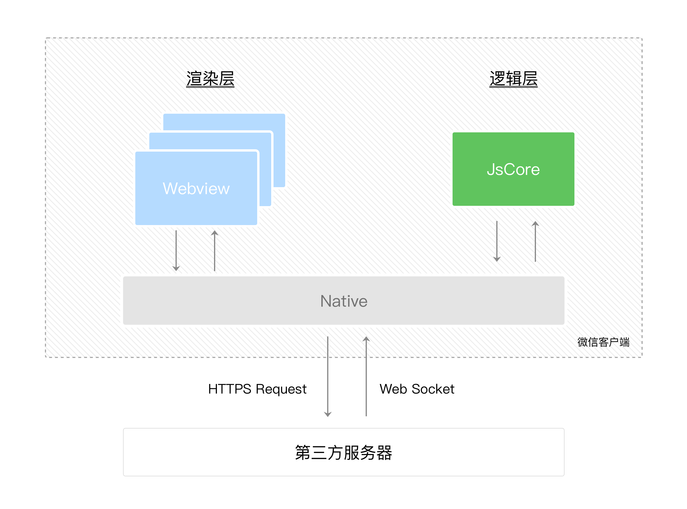

# 小程序框架

## 一、介绍

小程序开发框架的目标是通过尽可能简单、高效的方式让开发者可以在微信中开发具有原生 APP 体验的服务。

整个小程序框架系统分为两部分：逻辑层（App Service）和 视图层（View）。小程序提供了自己的视图层描述语言 WXML 和 WXSS，以及基于 JavaScript 的逻辑层框架，并在视图层与逻辑层间提供了数据传输和事件系统，让开发者能够专注于数据与逻辑。

其中 WXML 模板和 WXSS 样式工作在渲染层，JS 脚本工作在逻辑层。

小程序的渲染层和逻辑层分别由2个线程管理：渲染层的界面使用了WebView 进行渲染；逻辑层采用 JsCore 线程运行 JS 脚本。一个小程序存在多个界面，所以渲染层存在多个 WebView 线程，这两个线程的通信会经由微信客户端（下文中也会采用 Native 来代指微信客户端）做中转，逻辑层发送网络请求也经由 Native 转发，小程序的通信模型下图所示。

